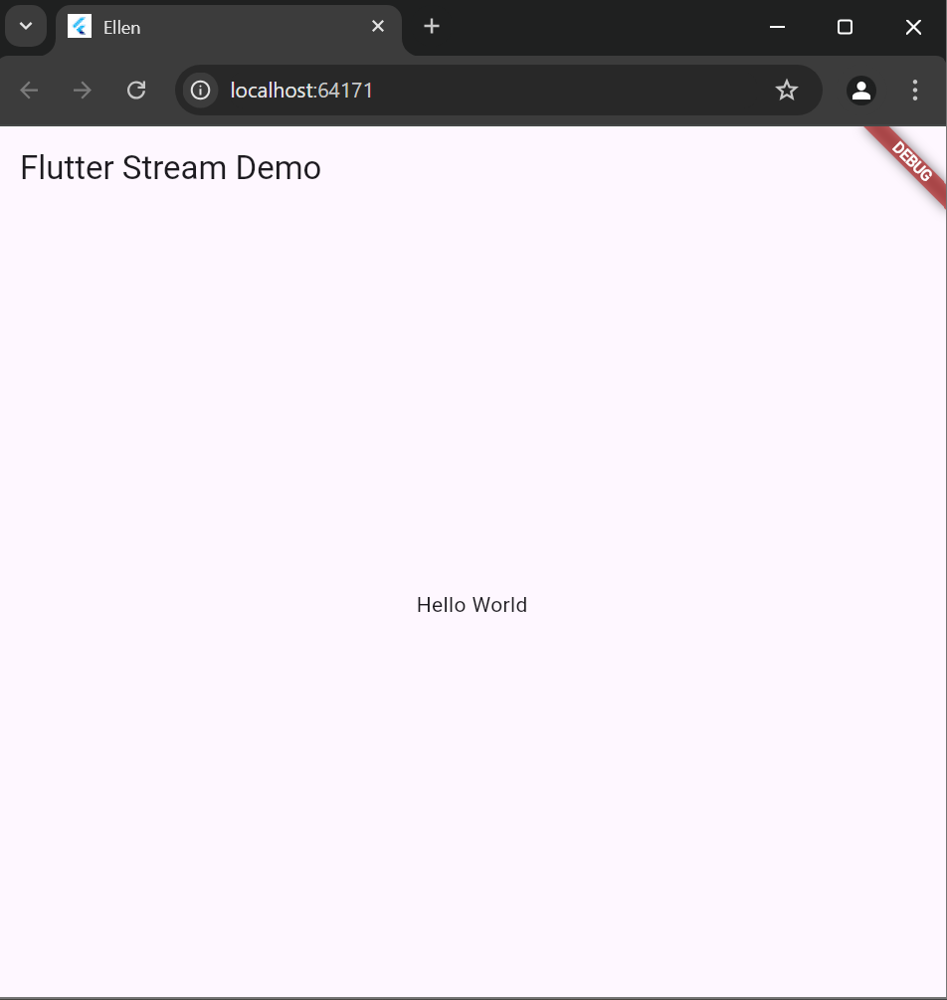
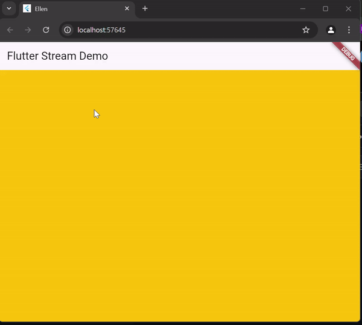

# flutter_application_1
# Octavio Ellen Hariyadi
# 362358302101
# 2D Trpl 

# Soal 1

# Soal 3 
Fungsi Keyword yield* untuk menghasilkan satu nilai dari sebuah fungsi generator. 

# Soal 4

# Soal 5
- Listen berfungsi untuk mendengar stream secara langsung, tidak perlu memblokir alur kode. 
- Await For untuk mengiterasi elemen stream secara urut dalan fungsi asinkron, dan bisa memblokir eksekusi hingga tiap elemen selesai berproses. 